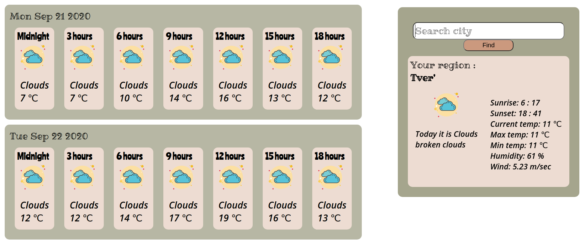

# Weather APP

### How to start
#### 1️⃣ step
```
 git clone git@github.com:AlimovaKatrin/WeatherAPP.git

 cd WeatherApp
 
 yarn install
```
#### 2️⃣ step
Create `.env.local` file out of `src` repo. 
Insert following :
```
REACT_APP_API_KEY=`your api key`
```
#### 3️⃣ step
```
yarn start
```


 
